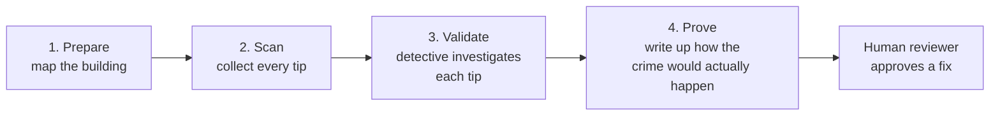
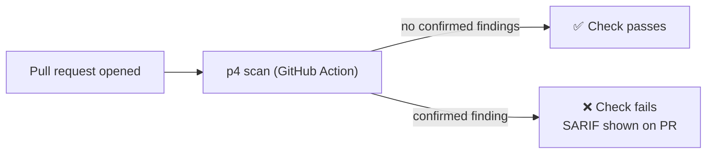

# How P4 works (in plain words)

This doc explains what P4 actually does and how the pieces fit together —
no prior security background assumed. If you just want to run it, see the
[README](../README.md).

## The problem in one sentence

Most automated code scanners are like a smoke alarm that also goes off when
you make toast: they flag *anything* that looks dangerous, and a human has
to manually figure out which alerts are real fires and which are just toast.
P4 adds a second layer that does that figuring-out automatically.

## The four-stage pipeline

Think of it like a tip line for a detective agency:



1. **Prepare** — before looking for problems, P4 reads through the target
   repository and builds a simple map: what files exist, what functions they
   define, and which ones are reachable from the internet (e.g. a Flask route
   like `POST /login`). This is `backend/core/prepare.py`.

2. **Scan** — a pattern-matching tool called [Semgrep](https://semgrep.dev)
   reads every file and flags anything that *looks* dangerous — a raw SQL
   query, a shell command built from user input, `pickle.loads()`, and so
   on. This step is deliberately noisy on purpose: it casts a wide net,
   the same way a cheap smoke alarm would. This is `backend/core/scan.py`
   plus the rules in `backend/rules/*.yaml`.

3. **Validate** — this is P4's actual contribution. Every candidate from
   step 2 gets handed to an LLM (Google Gemini) along with the surrounding
   code and the map from step 1. The model reads it the way a security
   engineer would: *"does user input actually reach this dangerous line, or
   is this fed a hardcoded value?"* It answers `confirmed` or
   `false_positive`, with a one-paragraph reason either way. It also tags
   each confirmed finding with a short label describing *what kind* of bug
   it is, so the same bug pattern found in three different repos can be
   recognized as "the same issue" instead of three separate tickets. This is
   `backend/core/validate.py` + `backend/core/dedupe.py`.

4. **Prove** — for every finding the model actually confirmed, it writes a
   runnable proof: a `curl` command or input string that would trigger the
   bug for real, not just a theoretical description. This turns "the model
   says this is dangerous" into "here's the exact request that breaks it,"
   which is much easier for a human to double check. This is
   `backend/core/prove.py`.

**Nothing gets auto-fixed.** A confirmed finding sits in an
"awaiting approval" state until a human clicks *Approve*, and only then
does the model draft a suggested patch. P4 never edits code on its own —
that's a deliberate design choice, not a missing feature.

## Two ways to use it

### 1. The dashboard (for a human reviewing findings)

A small React app (`frontend/`) that shows the four-stage pipeline running
live, lists every finding as an expandable card (code, the model's
reasoning, the proof, and an Approve button), and shows a side-by-side
comparison of "raw scanner output" vs. "P4 after Validate" so you can see
how many false alarms got cleared.

### 2. The `p4` CLI (for a machine — your CI pipeline)

The dashboard is for people; CI pipelines need an exit code. `p4` is the
same four-stage engine wrapped as a command-line tool with no server and no
clicking:

```bash
p4 scan .                    # exits 1 if it finds a confirmed vulnerability
p4 scan . --format sarif     # produces a report GitHub can show on a PR
```

That's what makes P4 "CI/CD-ready": drop `p4 scan` (or the packaged
[`action.yml`](../action.yml)) into a GitHub Actions workflow and it
becomes an automated gate that blocks a pull request the same way a failing
test would — except the thing failing is "this PR introduces a real,
LLM-confirmed vulnerability," not just a lint error.



## Measuring whether it actually works

It's easy to *claim* a tool reduces false positives; P4 measures it.
`sample_repos/` contains three small, intentionally-vulnerable apps with a
hand-labeled answer key (`sample_repos/ANSWER_KEY.json`) — real bugs,
convincing-looking fakes, and one bug pattern repeated across all three
repos to test the dedup logic. After every run, P4 computes precision/
recall/F1 for the raw scanner vs. itself and shows the comparison directly
in the dashboard (and via `p4 evaluate` on the command line). This is also
wired into this repo's own CI as a regression check — if a future change
makes P4 *worse* at telling real bugs from fake ones, the build fails.

## Where things live

| Folder | What's in it |
|---|---|
| `backend/core/` | The four pipeline stages, plus dedup, evaluation, SARIF/SLA/DefectDojo helpers |
| `backend/api/` | The FastAPI service behind the dashboard |
| `backend/cli.py` | The `p4` command-line tool |
| `backend/rules/` | The Semgrep pattern rules used in the Scan stage |
| `frontend/` | The React dashboard |
| `sample_repos/` | Demo vulnerable apps + the hand-labeled answer key |
| `tests/` | The automated test suite |
| `.github/workflows/` | This repo's own CI pipeline |
| `action.yml` | The reusable GitHub Action other repos can install |
| `Dockerfile`, `docker-compose.yml` | Container packaging |
